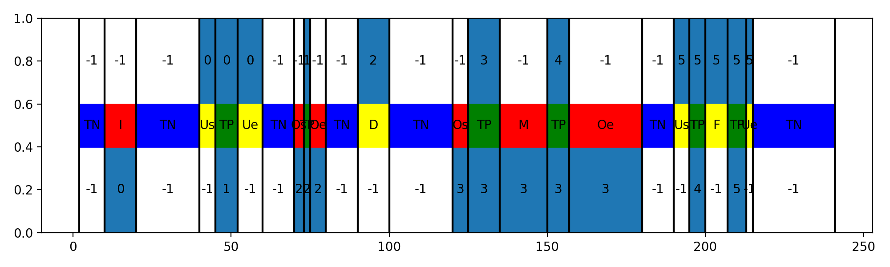

Descriptions
============
This is a short overview of the used naming conventions. For a more detailed discussion check out for example the paper :cite:`ward2011performance`.

Ground truth events:
    actual events that were annotated and will be considered as true instances of an activity. (However depending on the annotation quality they are not always 100% correct.)

Detected events:
    predicted events - typically results of a classifier's prediction step

Standard scores
---------------
Can be defined on a frame-by-frame basis. To calculate score values each frame is categorized with one of the following score labels:

True positives (TP):
    ground truth label for the current frame or segment equals the detected (predicted) label

False positives (FP):
    current frame or segment has a detected label for a particular class however the ground truth indicates that this class is not active

False negatives (FN):
    detected label is not equal to the ground truth when ground truth shows presence of the class

True negatives (TN):
    when neither the detected nor the corresponding ground truth label represents the class

Segments can be defined as a group of sequential frames where the assigned score labels don't change.

Precision:
    .. math::

        precision = \frac{TP}{TP + FP}

Recall:
    .. math::

        recall = \frac{TP}{TP + FN}

Calculation of event-based precision and recall
...............................................
We can
Assumption for True positive events
False positive
False negatives

TP_det, FP_det
todo: add formula

As mentioned in :cite:`ward2011performance`, there are several issues with these methods for event-based evaluation, especially that the nature of the errors remain mostly hidden. The authors propose additional segment categories to better describe the results.

Detailed scores
---------------
Detailed scores for ground truth events
.......................................
C - Correct:
    todo

F - fragmented:
    todo

M - merged:
    todo

FM - fragmented and merged:
    todo

D - deletion:
    todo practically equivalent of a false negative ground truth event

Detailed scores for detection events
....................................
C - Correct
F' - fragmenting: ...
M' - merging: ...
FM' - fragmenting and merging: ...
I' - insertion: ... basically equivalent of a false positive detection event

Detailed scores for segments
............................
Detailed segment categories:
____________________________
By using the detailed score categories, we can also evaluate the dataset on a frame-by-frame base receiving additional information on the event based errors.

To each segment (group of sequential frames with the same score label) we can assign one of the following categories:

* True positive - TP
* True negative - TN
* Insertion - I
* Merge - M,
* Deletion - D
* Fragmenting - F
* Start overfill - Os
* End overfill - Oe
* Start underfill - Us
* End underfill - Ue

As shown on the next figure:

Segment based metrics (2SET-metrics):
_____________________________________

todo: add example plot
